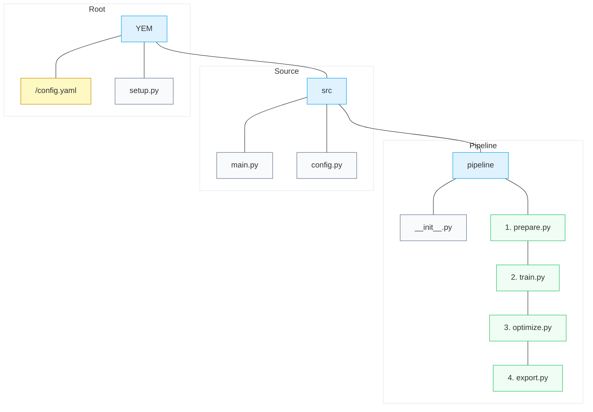

```mermaid
graph BT
    subgraph Root
        config["/config.yaml"]
        setup["setup.py"]
        yem[YEM]
        
        config --- yem
        setup --- yem
    end
    
    subgraph Source
        main["main.py"]
        configpy["config.py"]
        src[src]
        
        main --- src
        configpy --- src
    end
    
    subgraph Pipeline
        export["4. export.py"]
        optimize["3. optimize.py"]
        train["2. train.py"]
        prepare["1. prepare.py"]
        init["__init__.py"]
        pipe[pipeline]
        
        export --- optimize
        optimize --- train
        train --- prepare
        init --- pipe
        prepare --- pipe
    end
    
    src --- yem
    pipe --- src

    classDef default fill:#f8fafc,stroke:#64748b
    classDef directory fill:#e0f2fe,stroke:#0ea5e9
    classDef config fill:#fef9c3,stroke:#ca8a04
    classDef stage fill:#f0fdf4,stroke:#22c55e
    
    class yem,src,pipe directory
    class config config
    class prepare,train,optimize,export stage
    
    style Root fill:none,stroke:#e2e8f0
    style Source fill:none,stroke:#e2e8f0
    style Pipeline fill:none,stroke:#e2e8f0
```